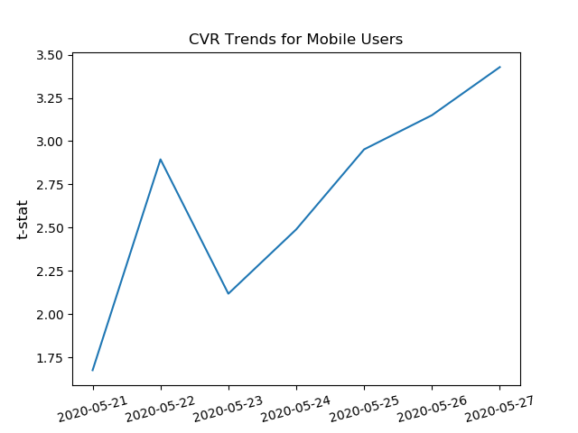
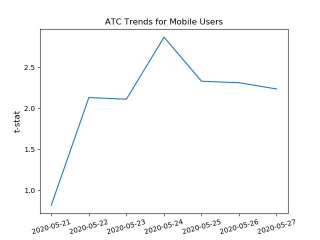

# DataAnalysisECommerce
This project aims to explore an e-commerce dataset containing information about visitors' activities during a seven-day period when an A/B test was conducted. 
Each row of data represents a session, and includes the following information:
1. Outcomes of interest
- Clicks: binary
- ATC (add-to-cart): binary
- CVR (conversion): binary
- SessionRevenue: integer
2. Visitors' information:
- SessionStartDate: date
- platform: categorical (mobile and desktop)
- visitorType: categorial (new, activated, returning, acquired)
- testGroup: categorical (control and variation)
- CategoryID (product types): categorical (TV Stands, sofas, area rugs, etc.)

### Part 1: Analyze whether the variation should be rolled out
Among mobile users, there's statistically significant positive lift for Session Revenue (1.61%), CVR (1.81%) and ATC (0.61%)

Analyzing results cumulatively:
- Given the short duration of the test, CVR performs the best with biggest lift at the end of the test period, most stable lift over time, and increasing t-stat over time
- Session revenue’s lift over time and t-stat over time both have U shape, indicating that customers need more time to adjust spending behavior
- ATC’s lift over time and t-stat over time are not stable

	 
	

	 
	

	 
	

### Part 2: Fit a number of machine learning models to understand what factors in the dataset can best predict conversion rate
1. From the limited available features (platform, visitor type, category), we can predict conversion rate with AUC score of 0.713

2. Under sampling to ensure balanced conversion outcomes in the sample improves the AUC score from 0.659 to 0.713

3. Best predictive model is random forest; however, it does not outperform other models such as logistic regression by a large margin

